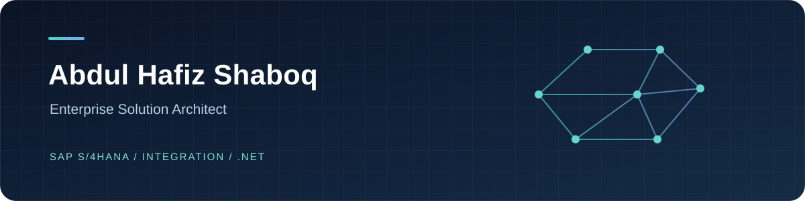

I design and deliver enterprise applications that connect business processes, SAP, and modern software. Over 16 years, my work has grown from hands-on engineering into architecture and technical leadership across multi-company environments in the Middle East.

I currently lead development and integration, shaping solution architecture, guiding delivery teams, and turning complex operational requirements into systems people can use reliably.

> **My focus:** clear architecture, dependable integration, and practical delivery.

## What I work on

| Area | Experience |
| --- | --- |
| **Enterprise architecture** | Application landscapes, solution design, security models, data architecture, and technical standards |
| **SAP & integration** | SAP S/4HANA, SD, ABAP, SAP-connected platforms, API design, and cross-system workflows |
| **Product engineering** | C#, ASP.NET MVC/Core, Web API, Blazor, SQL Server, and business applications |
| **Delivery leadership** | Multidisciplinary teams, architecture reviews, Agile delivery, ERP modernization, and rollout support |

## Selected work

- **SAP-connected operations:** Led the design and evolution of platforms spanning sales, inventory, purchasing, approvals, reporting, and customer processes.
- **S/4HANA programs:** Contributed technical leadership to implementations, regional rollouts, and a major version upgrade, with attention to integration continuity and business validation.
- **Integration & compliance:** Delivered SAP integration solutions for electronic invoicing and enterprise workflows.
- **Configurable business systems:** Designed solutions for commission management and multi-stage supply chain operations.

Most enterprise implementations are held in private repositories. This page describes my role and areas of work without exposing employer or client code.

## Technology

`SAP S/4HANA` · `SAP SD` · `ABAP` · `Fiori/UI5` · `C# / .NET` · `ASP.NET` · `REST APIs` · `SQL Server` · `Solution Architecture`

## Connect

Based in **Jeddah, Saudi Arabia**. I work in Arabic and English.

[LinkedIn](https://www.linkedin.com/in/abdulhafiz-shaboq)

---

**بالعربية:** أعمل على تصميم وتطوير الأنظمة المؤسسية وربط SAP بالتطبيقات الحديثة، مع التركيز على جودة الحل وقابلية تشغيله على أرض الواقع.
